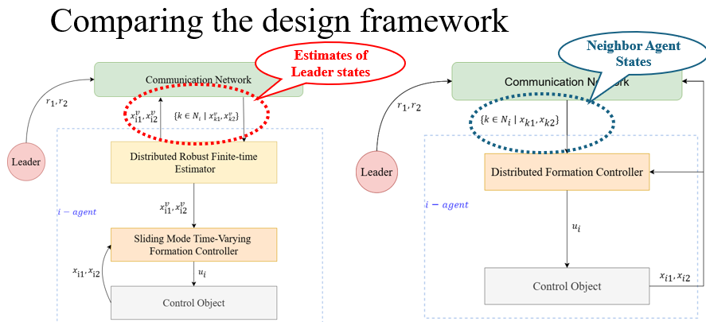
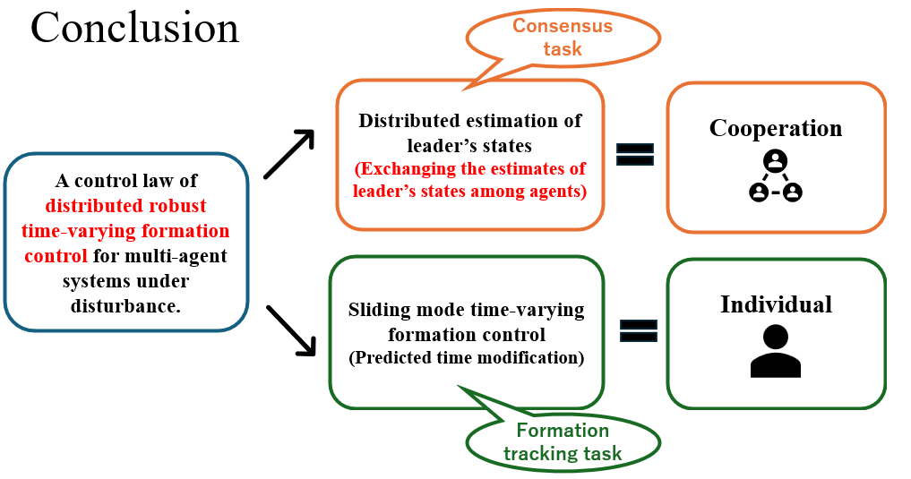

## Paper: Distributed Robust Time-Varying Formation Control of Multi-Agent Systems under Disturbances

by **Guang-Ze Yang $^1$** and **Zi-Jiang Yang $^2$**

> **Abstract:** This work considers the problem of time-varying formation tracking control of second-order multi-agent systems under disturbances. A distributed robust time-varying formation control law is proposed including **distributed finite-time estimators of the leader’s states** and **sliding mode time-varying formation controllers**. Firstly, each agent can quickly estimate the leader’s states through the communication network in the distributed finite-time estimators based on the sliding mode estimation. Secondly, utilizing the estimates of the leader’s states, a sliding mode time-varying formation controller is designed using **the prescribed time modification function**. Unlike traditional distributed control law relying on the exchanges of the agents’ states, the proposed control design achieves great robustness and stability of the overall system by **exchanging the estimates of the leader’s states**. According to Lyapunov stability analysis, we prove that the proposed approach enables the sliding variables to achieve fast finite-time convergence. Furthermore, simulation examples are provided to illustrate the performance.

This work has been accepted by 2024 63rd Annual Conference of SICE.

### Description





---
## Program Description
### `config.m`
- System Parameters and control parameters.
### `Leader_state.m`
- generate reference signal (Trajectory) and Plot the fig.
### `Formation_shape.m`
- generate time-varying formation shape and Plot the fig.
### `main.m`
- Estimator.
- Prescribed time modification.
- Sliding mode formation controller.
- System simulation.
### Figure programs in `Plot`
- Main figure
   1. `fig_motion.m`: 3D plotting of the agents' movement.
   2. `fig_error_e.m`: The errors of the estimator.
   3. `fig_states.m`: The states of the agents.
   4. `fig_error_pro.m`: The errors fo the formation controller.
   5. `fig_input.m`: The input of the formation controller.
   6. `Animation.m`: The animation of the agents' movement. (Run after finished `fig_states.m`)
- Addition figures
   1. `fig_states_e.m`: The states of the estimator.
   2. `fig_vinput.m`: The virtual input of the estimator.
   3. `fig_em.m`: The modified formation tracking errors.
   4. `fig_xi.m`: The prescribed time modification function.
   5. `fig_sliding.m`: The sliding variable.

## Running

```matlab
build.m
```


---
## Update
### 2024-08-01
The `Animation.m` program has been modified to make it easier to present.

### 2024-06-25
Globalize the state of the agents to use matrix computation instead of loops.

### 2023-03-11
Collision avoidance for MAS. (To be continued)

### 2024-01-21
The time-varying formation shape is realized using the SMFC algorithm.

### 2023-11-26
The distributed state estimation for consensus tracking control is introduced to  estimate the leader’s states.

### 2023-11-06
Trying to introduced the NN for disturbances. (Unsuccess)

### 2023-09-08
The prescribed time modification function to formation tracking errors in SMFC.

### 2023-07-30
Sliding mode formation controller(SMFC) for Centralized leader-follower is introduced.

---
1. Department of Mechanical Systems Engineering, Ibaraki University, Hitachi, Japan; Tel: +81-294-38-5205; E-mail: 24nm499s@vc.ibaraki.ac.jp
2. Department of Mechanical Systems Engineering, Ibaraki University, Hitachi, Japan;Tel: +81-294-38-5205; E-mail: shikoh.yoh.zijiang@vc.ibaraki.ac.jp